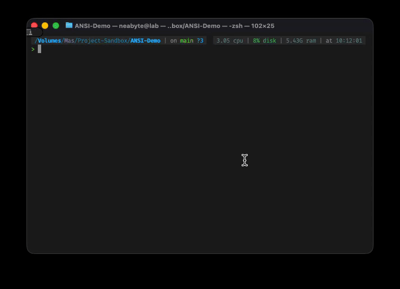

# ANSI Demo

Interactive demonstration of the [Deno ANSI](https://jsr.io/@neabyte/deno-ansi) library capabilities.



## Features

- 🎨 **Colors** - Basic colors, text styles, 256-color palette, RGB support
- 📍 **Cursor** - Movement, positioning, visibility control
- 🖥️ **Terminal** - Screen control, window titles, buffer switching
- ⌨️ **Input** - Keyboard handling, escape sequences, special keys
- 🖱️ **Mouse** - Tracking, clicks, event parsing

## Quick Start

```bash
# Run the demo
deno run demo.ts
```

## Controls

- **Arrow Keys** - Navigate menu
- **Enter** - Select demo
- **q** - Quit application

## License

This project is licensed under the MIT license. See the [LICENSE](LICENSE) file for more info.
